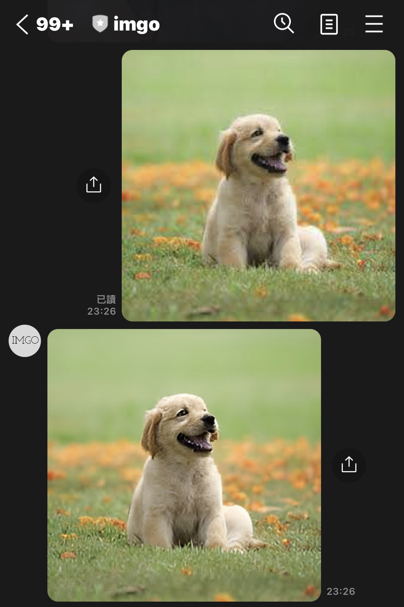
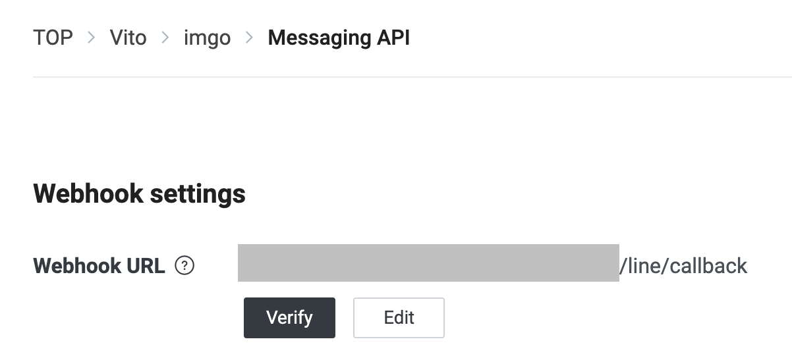

# Imgo

It's a tool that improve clarity of photos through an AI model.  

## What is Imgo

Imgo is a tool that can enhance the clarity of human faces. It combines the [Codeformer](https://replicate.com/sczhou/codeformer) model from the Replicate platform to safely and quickly improve the clarity of human faces.  

It's goal is to repair old or blurry photos through simple methods. It uses the LINE platform to allow users to easily interact with the AI model.  



Imgo offers a simple CLI that helps you start server and create consumer. In the next sections we will learn more about how to get started.  

## Getting started

Edit the config.toml.  

### Replicate

Configure your [Replicate](https://replicate.com/) token, the version of the codeformer model, and your HTTPS domain.  

```
[replicate]
url = "https://api.replicate.com/v1/predictions"
token = "{your token}"
version = "{model version}"
callback = "{server URL}/replicate/callback"
```

### Line

Create a channel on [LINE Developers](https://developers.line.biz/en/), then you can get your secret and token of the channel.  

```
[line]
secret = "{your secret}"
token = "{your token}"
```

You need to set your HTTPS domain to the Webhook URL of the Message API in your channel.  



### Redis

Configure your Redis.  

```
[redis]
user = "default"
password = ""
address = "localhost"
db = "0"
```

### RabbitMQ

Configure your RabbitMQ.  

```
[rabbitmq]
user = "guest"
password = "guest"
address = "localhost"
```

### S3 bucket

Configure your AWS access id, secret key, s3 bucket name, and region.  

```
[bucket]
id = "{aws access id}"
secret = "{aws secret key}"
name = "{s3 bucket name}"
region = "{region}"
```

If you do not have an HTTPS domain, you can use ngrok to easily give your server a temporary HTTPS domain.  

To get started, you need to type `docker compose up` to run container.

## Usage

Start server to receive photo from user.  

```
go run main.go server
```

Create a consumer to receive photo from Replicate and send photo to user.  

```
go run main.go consumer
```
